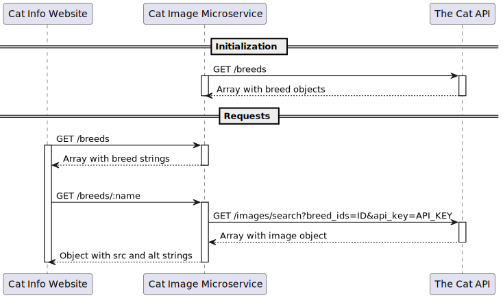

# Cat Image Microservice

This microservice is for Alexandria Wilson. It runs on Node.js and communicates via HTTP. Follow the instructions below to get started.

## Instructions

To start, you'll need a .env file with an API_KEY from [https://thecatapi.com/](https://thecatapi.com/) and a suitable PORT:

```
API_KEY=YOUR_API_KEY
PORT=3000
```

Download the ZIP, extract, add your .env file, and run the following commands:

```
npm install
npm start
```

It runs on localhost at the specified port (e.g., [http://localhost:3000](http://localhost:3000)) and supports the following endpoints:

```
/breeds
/breeds/:name //where name is a path parameter
```

The `/breeds` endpoint returns a list of breed names. These are used with the `/breeds/:name` endpoint, which returns a random image and a short description for that breed.

## Example request

```
(async () => {
  const obj = await fetch("http://localhost:3000/breeds/Abyssinian").then((res) => res.json());

  console.log(obj);
})();
```

## Example response

```
{
  "alt": "The Abyssinian is easy to care for, and a joy to have in your home. They’re affectionate cats and love both people and other animals.",
  "src": "https://cdn2.thecatapi.com/images/tv8tNeYaU.jpg"
}
```

## UML sequence diagram


